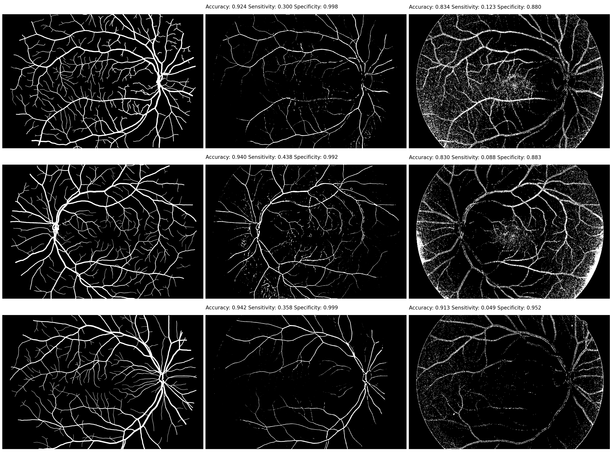
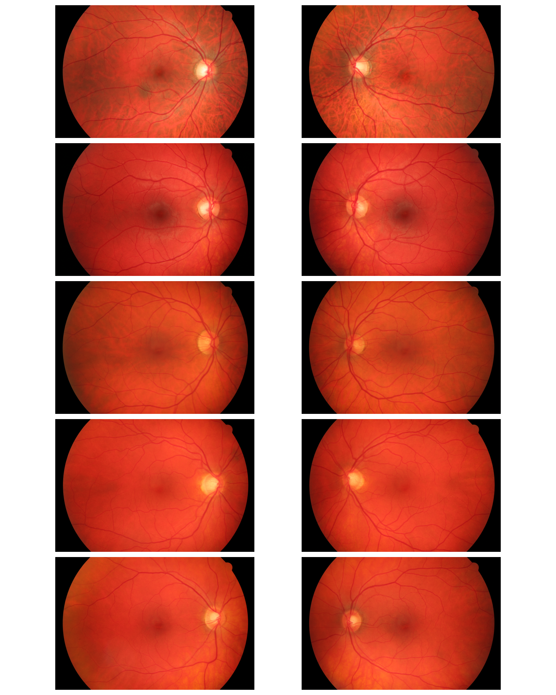
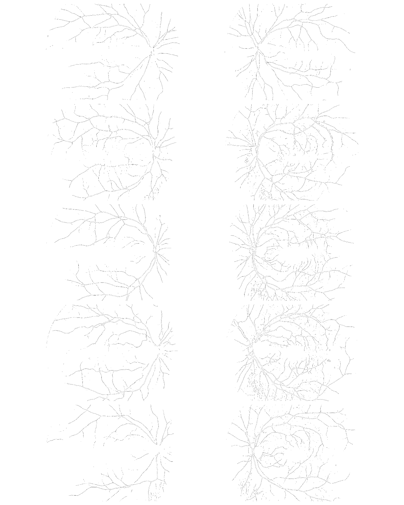

# Blood vessels segmentation
Predicting blood vessels for a given retina image using Random Forest Classifier and U-Net network.

## Manually labeled images, preprocessed images and predicted images with Random Forest Classifier and U-Net network.
 

## Original images

## Preprocessed images

 <!--  -->

