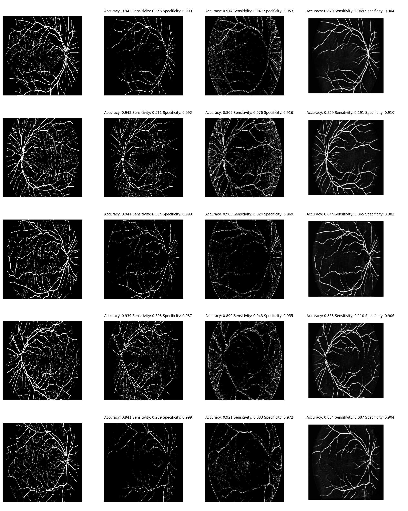

# Blood vessels segmentation
Automatically detecting blood vessels for a given retina image.

## Original images

## Preprocessed images

<!-- 
 -->
## Manually labeled images, preprocessed images and predicted images
 

